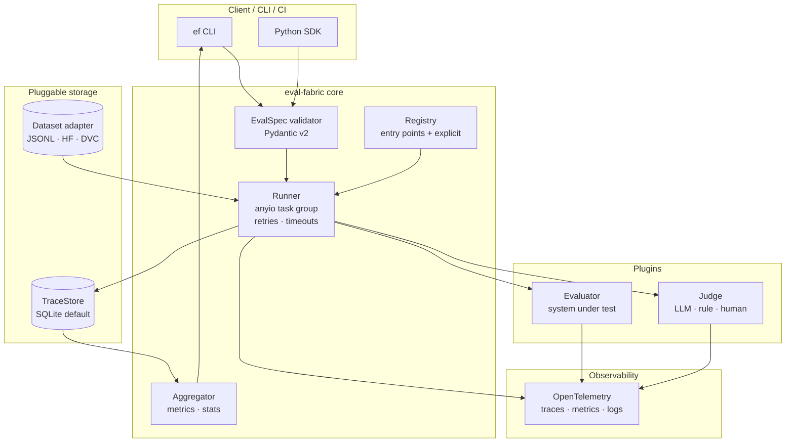

# Architecture

This document describes the system design of `eval-fabric`: its components, the data that flows between them, the tradeoffs that produced this shape, and the failure modes you should expect when operating it.

It assumes you have read the [README](../README.md) and have a working mental model of what the framework is for. For terminology, see [`concepts.md`](concepts.md).

---

## Context

### The forces shaping this design

Three constraints set the shape of the system. Anything we do has to respect all three.

**1. Eval is a multi-team concern, not a single-team product.**
A platform serving 10–50 teams cannot dictate model choice, judge prompt, or storage backend. It must dictate *contracts* and provide *primitives*. The architecture must let teams move fast inside well-defined seams.

**2. Eval workloads are I/O-bound and bursty.**
A single eval run is typically thousands of independent calls to a model (the system under test) and an LLM judge — both network-bound. Throughput is dominated by concurrency, not CPU. The runner has to be async-first and concurrency-bounded.

**3. Reproducibility is the product.**
Eval results are useless if you cannot replay them. Two months later, when you ship a new model and someone asks "is this better than what we had?", you must be able to re-run the exact eval against the exact dataset with the exact judge. Every architectural decision is filtered through "does this preserve replayability?"

### Operating envelope

The system is designed to operate well in the following envelope. Outside it, choices that are good become bad.

| Dimension       | Designed for                                                  | Outside the envelope                                                              |
| --------------- | ------------------------------------------------------------- | --------------------------------------------------------------------------------- |
| Run size        | 10² – 10⁶ items per run                                       | < 100: framework overhead dominates. Use a script. > 10⁷: shard externally.       |
| Concurrency     | 1 – 256 in-flight tasks per runner                             | > 1024: GIL contention shows. Run multiple runner processes.                      |
| Judge latency   | 100 ms – 30 s per judgment                                    | > 60 s: rethink. Either chunk the work or use a different judge architecture.     |
| Storage         | < 1 TB of trace data per environment                           | Larger: federate trace stores per team or per product.                            |
| Team count      | 1 – 50 teams sharing a deployment                              | > 50: federate. Single-tenant per business unit becomes the right shape.          |

These numbers are not arbitrary. They reflect what the design choices below actually scale to. If your numbers are well outside this envelope, the architecture is the wrong one and you should fork or pick something else — not bend this one until it breaks.

---

## Architecture overview

### Components



Each box is a concrete unit. Below is what each one does and the contract it exposes.

#### Runner — the orchestrator

The runner is the only component that owns concurrency, retry, timeout, and observability concerns. Evaluators and judges are pure: given an input, produce an output. Everything operationally interesting lives in the runner.

Responsibilities:

- Read the EvalSpec, resolve evaluator and judge IDs against the registry.
- Iterate over the dataset, producing a stream of `Task` objects.
- Dispatch tasks to evaluators with bounded concurrency (anyio task group + capacity limiter).
- Apply per-task timeout and retry policy.
- Emit OTel spans around every task and every judge call.
- Persist traces and judgments to the configured TraceStore.
- Surface a structured `RunResult` to the caller.

The runner is **synchronous from the caller's perspective**: `runner.run(spec, dataset)` blocks until done. Internally it is async. This is a deliberate ergonomic choice — most callers (CLI, CI) are not async, and forcing them to be poisons the API.

#### Registry — plugin discovery

The registry is a flat key-value store of plugin IDs to factories. There are two ways something gets in:

1. **Entry points.** A package declares an entry point under `eval_fabric.evaluators` or `eval_fabric.judges`. On import, eval-fabric discovers them via `importlib.metadata`. This is how third-party plugins are distributed.
2. **Explicit registration.** `register_evaluator("my_id", factory)` or a decorator. This is how application code adds local plugins without packaging them.

There are no base classes. Evaluators and judges are duck-typed against `Protocol` definitions. See [ADR-0002](decisions/0002-evaluator-plugin-via-entry-points.md).

#### EvalSpec validator — the contract

`EvalSpec` is a Pydantic v2 model. It is the single source of truth for what an evaluation is:

```python
class EvalSpec(BaseModel):
    id: str                          # "team/qa-bot"
    version: SemVer                  # "1.2.0"
    evaluator: EvaluatorRef
    judges: list[JudgeRef]
    scoring: ScoringConfig
    runtime: RuntimeConfig           # concurrency, timeouts, retries
    metadata: dict[str, str]         # team-defined, opaque to the framework
```

Validation runs once at the entry point of every command. After that, every component can assume the spec is well-formed. See [ADR-0001](decisions/0001-use-pydantic-for-eval-contracts.md) and [ADR-0004](decisions/0004-eval-spec-versioning-with-semver-and-codegen.md) for the schema and versioning model.

#### Evaluator — the system under test

An `Evaluator` produces an output for an input. It is what you are measuring. Examples:

- A wrapper around a deployed inference endpoint.
- A wrapper around a LangGraph agent.
- A simple function that calls `openai.chat.completions.create` with a fixed prompt template.

Contract:

```python
class Evaluator(Protocol):
    id: str
    version: str
    async def __call__(self, item: EvalItem) -> EvaluatorOutput: ...
```

Evaluators do not know about the runner, the trace store, or other evaluators. They are pure async callables. This separation is what makes the framework pluggable. See [ADR-0007](decisions/0007-separate-evaluator-and-judge.md) for why "Evaluator" and "Judge" are distinct roles.

#### Judge — the scorer

A `Judge` scores an `EvaluatorOutput` against a criterion. Three reference implementations ship in-tree:

- `RuleBasedJudge` — exact match, regex, JSON schema validation.
- `LLMJudge` — calls a configured LLM with a prompt template and returns a structured judgment.
- `HumanJudge` — emits a task to an external annotation queue and blocks (or polls) for the result.

Contract:

```python
class Judge(Protocol):
    id: str
    version: str
    determinism: Determinism      # see ADR-0008
    async def judge(self, item: EvalItem, output: EvaluatorOutput) -> Judgment: ...
```

#### TraceStore — pluggable persistence

`TraceStore` is a `Protocol` (not a base class) with several methods for run management, trace persistence, and querying:

```python
class TraceStore(Protocol):
    schema_version: int

    async def open(self) -> None: ...
    async def close(self) -> None: ...

    async def put_run(self, run: RunResult) -> RunId: ...
    async def put_trace(self, trace: Trace) -> TraceId: ...
    async def put_judgment(self, judgment: Judgment) -> JudgmentId: ...

    async def get_run(self, run_id: RunId) -> RunResult: ...
    async def get_trace(self, trace_id: TraceId) -> Trace: ...
    async def query_judgments(self, run_id: RunId) -> AsyncIterator[Judgment]: ...
    async def query_traces(self, run_id: RunId) -> AsyncIterator[Trace]: ...
```

The default implementation is a single-file SQLite database. Postgres and S3-Parquet adapters are reference implementations in `eval_fabric.contrib`. See [ADR-0005](decisions/0005-trace-store-as-protocol.md).

#### Aggregator — metrics

The aggregator is intentionally dumb. It reads judgments from the trace store and computes metrics declared in the EvalSpec's `scoring` block:

- Aggregate scalars (mean, median, count, rate-above-threshold).
- Bootstrap confidence intervals for sample size.
- Paired comparison against a baseline run (delta, sign test, paired t-test).

It does not do anything fancy. We deliberately avoid building a metrics DSL — it is a slippery slope to reinventing pandas badly. If you want a custom metric, write a function and register it.

### Data flow: one run, end to end

A run is the lifecycle from `ef run spec.yaml` to a persisted `RunResult`. Here is what happens:

```
1. Load and validate EvalSpec (Pydantic).
2. Resolve evaluator and judge IDs against the registry.
3. Open a TraceStore session, allocate a RunId.
4. Iterate dataset → stream of EvalItem.
5. For each item, in a bounded anyio task group:
     a. Open OTel span "eval.task".
     b. Call evaluator(item) with timeout + retry.
     c. Persist trace.
     d. For each judge in spec.judges:
          - Open OTel span "eval.judge".
          - Call judge(item, output) with timeout + retry.
          - Persist judgment.
6. Close task group; barrier on all in-flight tasks.
7. Aggregate judgments → RunResult.
8. Persist RunResult.
9. Return RunResult to caller.
```

The runner enforces an invariant at every persist step: **a partial run is always replayable**. If the process is killed at step 5c, the trace and any completed judgments are durable. A subsequent `ef resume` picks up from the last persisted item.

---

## Tradeoffs

These are the choices where we made a call that another reasonable team would make differently.

### Async-first, but synchronous from the outside

**What we did:** the public API is synchronous; the implementation is async with anyio.

**What we considered:** keeping it async all the way out. Would let advanced users embed the runner in their own event loops without a wrapper.

**Why we picked this:** 80% of callers are CLI or CI — neither is async-native. Forcing them to learn async to run an eval is a regressive choice. For the 20% of users who want to embed it, `runner.run_async()` is provided. If you want the option of async, you have it; you do not pay for it if you do not need it.

### Pydantic over Protobuf for contracts

**What we did:** EvalSpec and friends are Pydantic v2 models, with auto-generated JSON Schema.

**What we considered:** Protobuf with a generated Python client. Common at large eval orgs.

**Why we picked this:** Pydantic gives us runtime validation, IDE support, and JSON Schema for free. Protobuf wins on cross-language and on schema enforcement at network boundaries — but eval-fabric is a Python framework with a JSON-on-the-wire boundary at the HTTP/gRPC API. JSON Schema is sufficient there. The ergonomic cost of Protobuf for in-process Python is real and not justified by the wins. See [ADR-0001](decisions/0001-use-pydantic-for-eval-contracts.md).

If you operate eval at multi-language scale (Java/Go/Python evaluators in one run), this tradeoff inverts. We should fork or replace the contracts layer at that point. We are not pretending to be that framework.

### Plugin discovery via entry points, not subclassing

**What we did:** evaluators and judges are duck-typed against `Protocol`. Discovery is via Python entry points.

**What we considered:** an abstract base class hierarchy (`class MyJudge(BaseJudge): ...`).

**Why we picked this:** Inheritance hierarchies for plugins are a code smell at scale. They couple plugins to framework versions and make it hard to test plugins in isolation. Entry points + Protocols is what `pytest`, `setuptools`, and `flake8` use, and it works at much larger scale than any eval system we will build. See [ADR-0002](decisions/0002-evaluator-plugin-via-entry-points.md).

### Separate Evaluator and Judge

**What we did:** the "thing being measured" and the "thing doing the measuring" are different abstractions with different IDs and different versions.

**What we considered:** a single `Evaluator` interface that can both produce and score. Some popular eval frameworks do this.

**Why we picked this:** conflating them makes auto-evaluator drift impossible to reason about. If a judge model and the system-under-test are the same abstraction, you cannot ask "did my system regress, or did my judge change?" without painful surgery. The cost of two interfaces is one extra concept; the benefit is decades of confusion avoided. See [ADR-0007](decisions/0007-separate-evaluator-and-judge.md).

### One-process runner, not a distributed scheduler

**What we did:** the runner is a single process. Scaling horizontally means running more runner processes, each with its own dataset shard.

**What we considered:** building in a Ray / Dask / Celery distribution layer.

**Why we picked this:** the workload is I/O-bound. A single anyio task group with concurrency=256 saturates a typical 10 Gbps NIC against any commercial LLM API. Distributed coordination adds a class of failures (network partitions, scheduler bugs, queue backlog) that buy you nothing for this workload. Teams that need 10⁷+ items shard externally — every CI system can fan out shards.

If we were CPU-bound (e.g., judging audio with a local model), this changes. We would build a worker pool. We are not, today.

---

## Scalability and failure modes

### Where the system is bounded

- **Concurrency:** capped per runner instance (default 64, configurable up to 256). Above that, GIL contention and connection-pool exhaustion against the LLM API matter more than throughput. Run more runner processes.
- **Trace store throughput:** SQLite handles ~5k writes/sec for our payload sizes. For higher throughput, switch to the Postgres adapter (`eval_fabric.contrib.postgres`). For archival, S3-Parquet is the long-tail backend.
- **Memory:** the runner streams items and never holds the full dataset in memory. Memory grows with concurrency, not run size. At concurrency=256, each in-flight task holds an EvalItem and an evaluator output — typically < 10 KB each, so < 3 MB in flight.

### Failure modes you will hit

| Failure                              | What happens                                                       | Mitigation                                                                                  |
| ------------------------------------ | ------------------------------------------------------------------ | ------------------------------------------------------------------------------------------- |
| Evaluator timeout                    | Task is cancelled; trace marked `status=timeout`; retry per policy | Set `runtime.task_timeout_seconds` realistically. Default 60s.                              |
| Judge LLM rate-limited (429)         | Backoff with jitter; retry up to `runtime.max_retries`             | Configure rate-limited judges with explicit `max_concurrent` lower than evaluator.          |
| Trace store unavailable              | Runner halts on first persist failure (no silent data loss)        | TraceStore implementations must be highly available. SQLite is a single point of failure.   |
| OTel collector down                  | Telemetry dropped; run continues                                   | Observability is best-effort. Never fail a run because telemetry failed.                    |
| Process killed mid-run               | Persisted traces and judgments durable; in-flight tasks lost       | `ef resume <run_id>` continues from last persisted item.                                    |
| Schema-incompatible plugin           | Validation error at registry load, before any tasks dispatched     | Plugins declare a compatible EvalSpec major version range in their entry-point metadata.    |
| Non-deterministic judge replay drift | Replay produces different scores                                   | Judges declare `Determinism`. Replay tooling reports drift explicitly. See [ADR-0008](decisions/0008-judge-determinism-contract.md). |

### What we explicitly do not handle

- **Cross-runner coordination.** If you run two `ef run` invocations against the same trace store with the same `run_id`, they will both write. This is your problem to avoid (use unique run IDs, which is the default).
- **Trace store schema migrations across major versions.** Major version upgrades require running an explicit migration. We do not silently migrate.
- **Plugin sandboxing.** Plugins run in the same process and can do anything Python can do. Treat plugin authorship as you would treat library authorship — review code, pin versions.

---

## Security and data considerations

A full threat model lives in [`SECURITY.md`](../SECURITY.md). Architecture-level highlights:

- **Datasets and evaluator outputs may contain PII or sensitive data.** The framework treats all `EvalItem` content as opaque bytes from a trust perspective. It does not log item content at INFO level. Trace stores are configured with at-rest encryption when the backend supports it.
- **Judge models may be third-party APIs.** The framework does not prevent you from sending sensitive data to a third-party judge — that is a policy decision. We provide hooks (`pre_judge_hook`) where teams can implement redaction or routing.
- **Plugins are trusted code.** A malicious plugin can read the file system and exfiltrate data. Treat the registry of installed plugins as a privileged set.
- **Secrets management.** Evaluators and judges receive credentials via environment variables resolved at runtime, never from EvalSpec. EvalSpec is committed to version control; credentials are not.

---

## What this architecture is not

A few things this design intentionally is not, even if it might look like it could be:

- **It is not a benchmark suite.** No datasets ship with the framework.
- **It is not a model gateway.** It does not proxy or rate-limit model API calls beyond per-judge concurrency limits.
- **It is not a research notebook.** The CLI and SDK are designed for repeatable, version-controlled use, not exploratory work. Use it from a notebook freely; it is not optimized for that path.
- **It is not a multi-tenant SaaS platform.** Authorization, billing, and tenant isolation are out of scope. Teams deploy their own instance.

If your problem looks like one of these, the framework is not the right fit. The honest answer is more useful than a half-fitting tool.